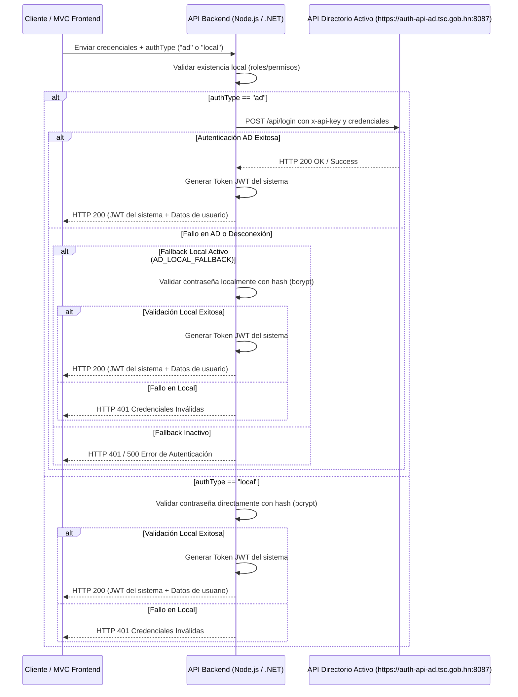

# Guía de Integración: Autenticación con Directorio Activo Institucional (TSC)

Esta guía detalla el procedimiento técnico para integrar la API de autenticación de Directorio Activo (AD) de la institución en cualquier proyecto de software, utilizando tanto **Node.js (Javascript/TypeScript)** como **C# (.NET Core)**.

---

## 1. Arquitectura y Flujo de Autenticación

El flujo recomendado sigue un patrón de desacoplamiento de servicios y seguridad de red con soporte para conmutación de origen (AD vs Local):



---

## 2. Parámetros de la API de Directorio Activo

Para realizar la autenticación, se deben emplear los siguientes parámetros provistos por la institución:

*   **URL del Endpoint:** `https://auth-api-ad.tsc.gob.hn:8087/api/login`
*   **Método:** `POST`
*   **Encabezados (Headers):**
    *   `Content-Type: application/json`
    *   `x-api-key: [API_KEY_PROVISTA]`
*   **Cuerpo de la Petición (JSON):**
    ```json
    {
      "usuario": "usuario_ad",
      "contrasena": "contrasena_ad"
    }
    ```

---

## 3. Implementación en Node.js (Express / NestJS)

Esta implementación utiliza el módulo nativo `https` de Node.js, lo cual garantiza compatibilidad absoluta sin requerir librerías externas adicionales y permitiendo el manejo avanzado de certificados autofirmados.

### Paso 1: Configurar variables de entorno (`.env`)
Agregue las siguientes variables en su archivo de configuración ambiental:

```env
# Configuración del Directorio Activo
AD_AUTH_ENABLED=true
AD_API_URL=https://auth-api-ad.tsc.gob.hn:8087/api/login
AD_API_KEY=tu_api_key_institucional_aqui
AD_LOCAL_FALLBACK=true
AD_REJECT_UNAUTHORIZED=true
```

### Paso 2: Crear el Helper de comunicación
Cree una función helper para realizar la solicitud HTTPS de manera asíncrona:

```javascript
const https = require('https');

/**
 * Realiza la petición POST segura al API de Directorio Activo
 * @param {string} url URL completa del servicio
 * @param {string} apiKey Api Key de acceso
 * @param {string} username Nombre de usuario a autenticar
 * @param {string} password Contraseña del usuario
 * @returns {Promise<{ok: boolean, status: number, body: string}>}
 */
const callAdApi = (url, apiKey, username, password) => {
    return new Promise((resolve, reject) => {
        try {
            const urlObj = new URL(url);
            const postData = JSON.stringify({
                usuario: username,
                contrasena: password
            });

            const options = {
                hostname: urlObj.hostname,
                port: urlObj.port || 443,
                path: urlObj.pathname + urlObj.search,
                method: 'POST',
                headers: {
                    'Content-Type': 'application/json',
                    'x-api-key': apiKey,
                    'User-Agent': 'Mozilla/5.0 (Windows NT 10.0; Win64; x64) AppleWebKit/537.36 (KHTML, like Gecko) Chrome/120.0.0.0 Safari/537.36',
                    'Accept': 'application/json, text/plain, */*',
                    'Content-Length': Buffer.byteLength(postData)
                },
                // Desactivar temporalmente si el entorno de red institucional tiene problemas de confianza SSL
                rejectUnauthorized: process.env.AD_REJECT_UNAUTHORIZED !== 'false'
            };

            const req = https.request(options, (res) => {
                let data = '';
                res.on('data', (chunk) => { data += chunk; });
                res.on('end', () => {
                    resolve({
                        ok: res.statusCode >= 200 && res.statusCode < 300,
                        status: res.statusCode,
                        body: data
                    });
                });
            });

            req.on('error', (e) => reject(e));

            // Configurar un tiempo de espera (timeout) de 5 segundos
            req.setTimeout(5000, () => {
                req.destroy(new Error('Tiempo de espera agotado al conectar con el Directorio Activo'));
            });

            req.write(postData);
            req.end();
        } catch (err) {
            reject(err);
        }
    });
};
```

### Paso 3: Integrar en el Servicio de Autenticación (con soporte de `authType`)
Reemplace o complemente su lógica de validación de contraseñas de la siguiente manera:

```javascript
const bcrypt = require('bcryptjs');

/**
 * Servicio de inicio de sesión con soporte multiorigen
 * @param {string} username Usuario del sistema
 * @param {string} password Contraseña ingresada
 * @param {string} authType Método seleccionado ("ad" o "local")
 */
const login = async (username, password, authType) => {
    // 1. Buscar al usuario en la base de datos local para verificar existencia y cargar roles
    const user = await database.findUserByUsername(username);
    if (!user || user.is_deleted) {
        throw new Error('Usuario no válido o eliminado');
    }
    
    if (user.is_locked) {
        throw new Error('Usuario bloqueado por seguridad');
    }

    let isAuthenticated = false;
    
    // Autenticar por AD si está habilitado globalmente AND (es tipo "ad" o no viene definido)
    const useAd = process.env.AD_AUTH_ENABLED === 'true' && (authType === 'ad' || !authType);

    if (useAd) {
        try {
            // Intentar autenticar contra el AD Institucional
            const adResponse = await callAdApi(
                process.env.AD_API_URL,
                process.env.AD_API_KEY,
                username,
                password
            );

            if (adResponse.ok) {
                isAuthenticated = true;
            } else {
                console.warn(`[AD Auth] Credenciales rechazadas en AD para: ${username}`);
                
                // Fallback a base de datos local si está habilitado
                if (process.env.AD_LOCAL_FALLBACK === 'true') {
                    isAuthenticated = verifyLocalPassword(password, user.password_hash);
                }
            }
        } catch (error) {
            console.error(`[AD Auth] Error de conexión con AD:`, error.message);
            
            // Fallback a base de datos local ante caídas de red o servidor AD caído
            if (process.env.AD_LOCAL_FALLBACK === 'true') {
                isAuthenticated = verifyLocalPassword(password, user.password_hash);
                if (!isAuthenticated) {
                    throw new Error('Credenciales incorrectas o Directorio Activo no disponible');
                }
            } else {
                throw new Error('Servicio de autenticación institucional no disponible');
            }
        }
    } else {
        // Autenticación puramente local
        isAuthenticated = verifyLocalPassword(password, user.password_hash);
    }

    if (!isAuthenticated) {
        throw new Error('Credenciales incorrectas');
    }

    // Generar token JWT del sistema y retornar
    return generateSystemTokens(user);
};

const verifyLocalPassword = (password, hash) => {
    if (!hash) return false;
    return bcrypt.compareSync(password, hash);
};
```

---

## 4. Implementación en C# (.NET Core / ASP.NET MVC)

Si desea consumir la API de AD directamente desde un proyecto C# .NET y ofrecer la pantalla de selección al usuario:

### Paso 1: Configurar el ViewModel del Login
Añada la propiedad `AuthType` para capturar la selección del formulario en `LoginViewModel.cs`:

```csharp
public class LoginViewModel
{
    public string Usuario { get; set; }
    public string Password { get; set; }
    public string AuthType { get; set; } = "ad"; // Valor por defecto
}
```

### Paso 2: Crear el Selector Visual en `Login.cshtml`
Añada una sección estética de selección segmentada que use TailwindCSS y modifique de forma interactiva con JavaScript las clases y los inputs ocultos:

```html
@model LoginViewModel

<form asp-action="Login" method="post" class="space-y-6">
    <!-- Componente de Selección de Origen de Autenticación -->
    <div class="mb-5">
        <label class="block text-sm font-medium text-gray-700 mb-2">Método de Acceso</label>
        <div class="grid grid-cols-2 gap-1.5 p-1.5 bg-gray-100 rounded-lg">
            <label class="flex justify-center items-center py-2 px-3 text-xs font-semibold rounded-md cursor-pointer transition-all duration-200 text-center select-none" id="label-ad">
                <input type="radio" asp-for="AuthType" value="ad" class="sr-only" checked />
                <i data-lucide="shield-check" class="h-4 w-4 mr-1.5 text-indigo-500"></i>
                Directorio Activo
            </label>
            <label class="flex justify-center items-center py-2 px-3 text-xs font-semibold rounded-md cursor-pointer transition-all duration-200 text-center select-none" id="label-local">
                <input type="radio" asp-for="AuthType" value="local" class="sr-only" />
                <i data-lucide="key-round" class="h-4 w-4 mr-1.5 text-gray-400"></i>
                Usuario Local
            </label>
        </div>
    </div>

    <!-- Campos de Usuario y Contraseña estándar -->
    <div>
        <label asp-for="Usuario" class="block text-sm font-medium text-gray-700">Usuario</label>
        <input asp-for="Usuario" required class="block w-full rounded-lg border border-gray-300 px-3 py-2 text-sm focus:ring-indigo-500" />
    </div>
    <div>
        <label asp-for="Password" class="block text-sm font-medium text-gray-700">Contraseña</label>
        <input asp-for="Password" type="password" required class="block w-full rounded-lg border border-gray-300 px-3 py-2 text-sm focus:ring-indigo-500" />
    </div>

    <button type="submit" class="w-full py-2 bg-indigo-600 hover:bg-indigo-700 text-white rounded-lg font-medium text-sm transition-colors">
        Entrar
    </button>
</form>

<script>
    document.addEventListener("DOMContentLoaded", function () {
        const radAd = document.querySelector('input[value="ad"]');
        const radLocal = document.querySelector('input[value="local"]');
        const lblAd = document.getElementById('label-ad');
        const lblLocal = document.getElementById('label-local');

        function updateTabs() {
            if (radAd.checked) {
                lblAd.className = "flex justify-center items-center py-2 px-3 text-xs font-semibold rounded-md cursor-pointer transition-all duration-200 text-center select-none bg-white text-indigo-700 shadow-sm border border-gray-200/50";
                lblLocal.className = "flex justify-center items-center py-2 px-3 text-xs font-semibold rounded-md cursor-pointer transition-all duration-200 text-center select-none text-gray-500 hover:text-gray-700";
                lblAd.querySelector('i').className = "h-4 w-4 mr-1.5 text-indigo-500";
                lblLocal.querySelector('i').className = "h-4 w-4 mr-1.5 text-gray-400";
            } else {
                lblAd.className = "flex justify-center items-center py-2 px-3 text-xs font-semibold rounded-md cursor-pointer transition-all duration-200 text-center select-none text-gray-500 hover:text-gray-700";
                lblLocal.className = "flex justify-center items-center py-2 px-3 text-xs font-semibold rounded-md cursor-pointer transition-all duration-200 text-center select-none bg-white text-indigo-700 shadow-sm border border-gray-200/50";
                lblAd.querySelector('i').className = "h-4 w-4 mr-1.5 text-gray-400";
                lblLocal.querySelector('i').className = "h-4 w-4 mr-1.5 text-indigo-500";
            }
        }

        if (radAd && radLocal) {
            radAd.addEventListener('change', updateTabs);
            radLocal.addEventListener('change', updateTabs);
            updateTabs();
        }
    });
</script>
```

### Paso 3: Consumo de la API pasando `authType` desde C#
Modifique su cliente HTTP de autenticación en C# para enviar el origen de autenticación seleccionado en la carga útil:

```csharp
public async Task<LoginResult> LoginAsync(string usuario, string password, string authType)
{
    var loginData = new { username = usuario, password = password, authType = authType };
    var content = new StringContent(JsonConvert.SerializeObject(loginData), Encoding.UTF8, "application/json");

    try
    {
        var response = await _httpClient.PostAsync("auth/login", content);
        var jsonResult = await response.Content.ReadAsStringAsync();

        if (!response.IsSuccessStatusCode)
        {
            dynamic errorResponse = JsonConvert.DeserializeObject(jsonResult);
            string errorMessage = errorResponse?.message ?? "Error en el servidor";
            return new LoginResult { Success = false, ErrorMessage = errorMessage };
        }

        var tokenResponse = JsonConvert.DeserializeObject<TokenResponse>(jsonResult);
        return new LoginResult { Success = true, Token = tokenResponse.AccessToken };
    }
    catch (Exception ex)
    {
        return new LoginResult { Success = false, ErrorMessage = "Error de conexión: " + ex.Message };
    }
}
```

---

## 5. Buenas Prácticas de Seguridad y Red

1.  **Protección de la API Key:** Nunca exponga la API Key en el código fuente de los clientes frontend (como React o aplicaciones móviles). El frontend siempre debe autenticarse contra su propio backend, y el backend realiza la consulta al AD tras bambalinas.
2.  **Ignorar verificación SSL ( rejectUnauthorized: false )**:
    > [!WARNING]
    > Utilizar `rejectUnauthorized: false` o ignorar certificados SSL **sólo está permitido en entornos de desarrollo local**. En producción, los servidores institucionales deben tener instalada la cadena de certificados de confianza del TSC para evitar ataques de intermediario (Man-in-the-Middle).
3.  **Gestión de Intentos Fallidos (Lockout):** Aunque el Directorio Activo cuente con sus propias políticas de bloqueo de cuenta, es altamente recomendable mantener habilitado un sistema local de auditoría y log en la tabla local (`sec.usuario`) para alertar sobre patrones anormales de intentos de sesión (fuerza bruta).
4.  **Manejo de Timeouts:** Siempre defina un tiempo límite de respuesta corto para la API de AD (máximo de 5 a 10 segundos). Esto evita que caídas en la red institucional dejen colgados los hilos de ejecución de los servidores de aplicaciones del sistema.
